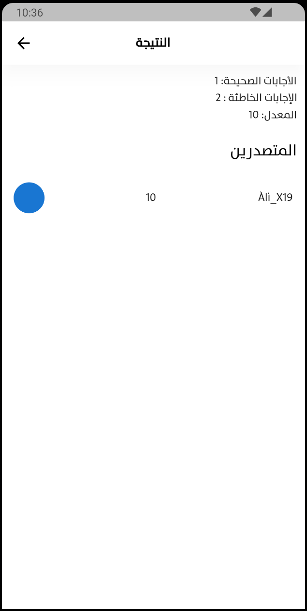

# Mobize App Test

## Features

- Users can log in using their Google accounts.
- They can take a multiple-choice exam consisting of three questions (1 + 1, 2 + 2, 3 + 3).
- At the end of the exam, correct and incorrect answers must be displayed.
- The result must be displayed and linked as a Demo in the Leaderboard.
- Users can receive notifications via OneSignal.

## Dependencies

- [Firebase](https://firebase.google.com/) for authentication and data storage.
- [OneSignal](https://onesignal.com/) for sending notifications.
- Bloc Cubit State Management.
- Clean Architecture (Uncle Bob).

## Setup

1. You need to set up a Firebase account and create a new project.
2. Select your Flutter app in Firebase and download the `google-services.json` file.
3. Copy the `google-services.json` file to the `android/app` folder in your Flutter project.

## Installation

1. Run `flutter pub get` to install all required packages.
2. Run the app using `flutter run`.

## How to Use

- Log in using your Google account.
- Choose the exam and answer the questions.
- View the results and see the correct and incorrect answers.

## Integration with Firebase

1. Open your Firebase account and create a new project.
2. Copy the `google-services.json` file you downloaded from Firebase to the `android/app` folder in your Flutter project.

## Integration with Leaderboard

- Integration with the Leaderboard is included as part of the project requirements.

## Integration with OneSignal

1. Visit [OneSignal](https://onesignal.com/) and create your account.
2. Create a new app and get your API key.
3. Use the API key to configure OneSignal in the app.

## Project Structure

The project follows the Clean Architecture principles as advocated by Uncle Bob. It is divided into the following layers:

- Presentation Layer (UI, Widgets, Pages)
- Application Layer (Cubit, Bloc)
- Domain Layer (Use Cases)
- Data Layer (Repositories, Data Sources)
- Infrastructure Layer (External Services, Firebase, OneSignal)

## Challenges and Known Issues

- None.
